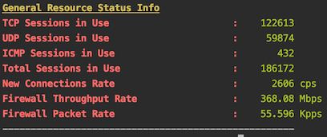
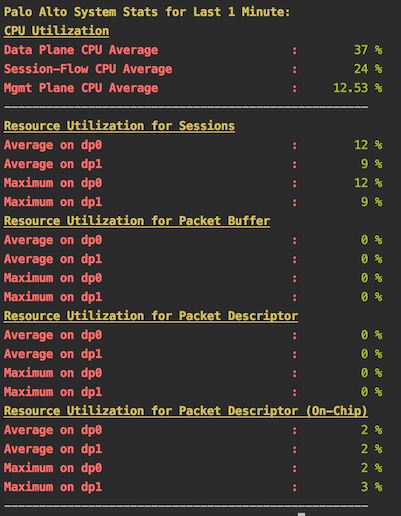
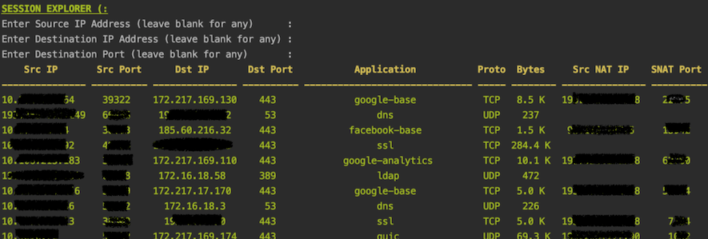
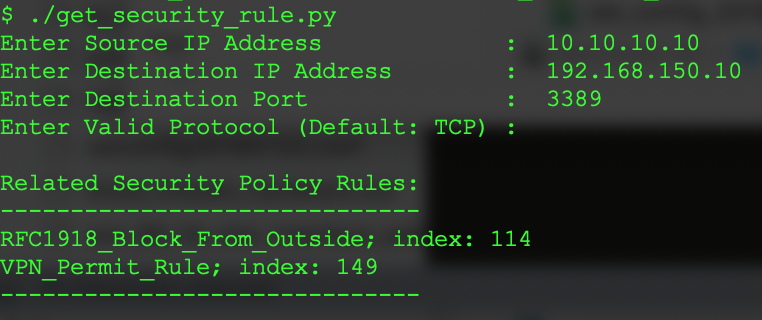

## About
> These scripts utilize PAN OS api interface on Palo Alto Networks Firewall
to get some information and print on terminal screen in a formatted way.

1. **get_stats.py :** _prints values about resources such as CPU, sessions, buffer etc._

2. **get_session_info.py :** _prints established sessions according to entered
source, destination IP addresses and destination port._

3. **get_arp_table.py :** _prints arp table_

4. **get_security_rule.py :** _print related policy rules against entered source,
destination IP addresses and destination port. This function is also included in
get_session_info.py code._

### Screenshots

#### 1. get_stats.py
> resource status function output:



> CPUs, sessions, buffer utilization function enabled output:



#### 2. get_session_info.py

_A file named "last_sessions_file.txt" is saved to the same directory. 
To sort with respect to bytes column in bash shell:_
```Shell
$ grep " M " last_sessions_file.txt | tr -s ' ' | sort -k7 -n
```
> any sessions output:



#### 3. get_arp_table.py

_Prints arp table in the firewall without sshing to it._

#### 4. get_security_rule.py



> Since source-destination zones are not asked, the output could provide
non-relevant rules (RFC1918...) as above; but it is left to assessment of the administrator
due some rules might not have been created with zone definitions and not to overlook
because of that.

----

> *Beware:* Include a file named "credential.py" with content as below in the same directory
with these scripts; or uncomment relevant lines in scripts and enter credential.

```
PANOS_IP_ADDR = "IP ADDRESS"
PANOS_API_TOKEN = "TOKEN"
```